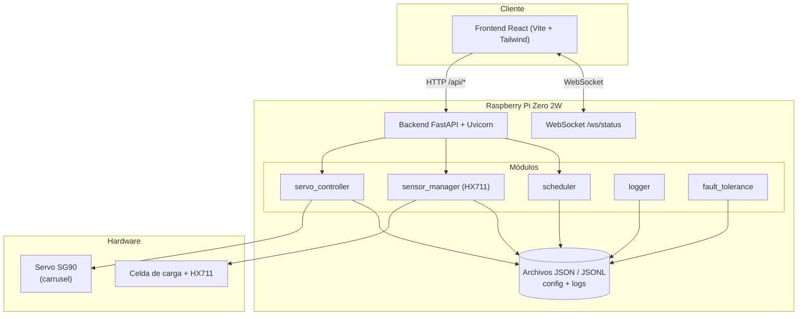
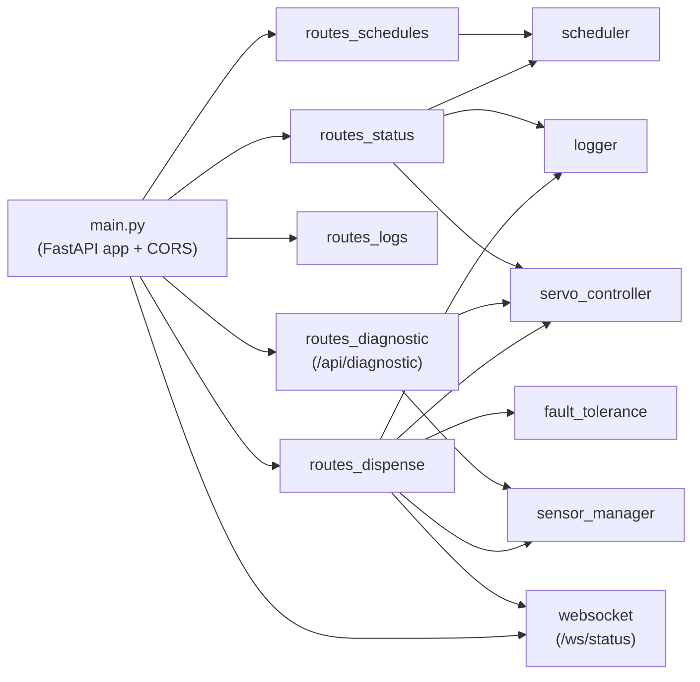
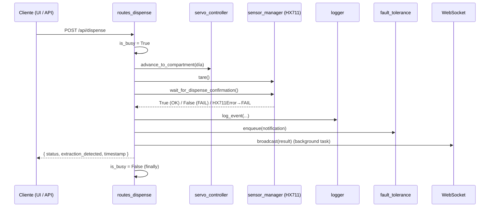

# Arquitectura — HealthTech

Dispensador Inteligente de Medicamentos sobre Raspberry Pi Zero 2W.

Este documento describe la arquitectura **tal como está implementada en el código**. Donde
el código diverge del documento de diseño original (`healtech_doc.pdf`), se indica con una
nota explícita.

---

## 1. Visión general

HealthTech es un dispensador semanal de medicamentos. Un carrusel rotativo con un
compartimento por día de la semana se posiciona frente al punto de retiro, y una celda de
carga verifica físicamente que el medicamento haya sido retirado (caída de peso).

A diferencia del diseño monolítico en Python puro descrito en el PDF, la implementación real
es una **aplicación full-stack**:

- **Backend**: API REST + WebSocket en **FastAPI** (Python), corriendo sobre la Raspberry Pi.
- **Frontend**: SPA en **React + Vite + Tailwind v4**, servida al cuidador/administrador.
- **Hardware**: controlado por el backend vía GPIO (servo SG90 y módulo HX711).



---

## 2. Componentes de hardware

| Componente | Modelo | Función | Pin (BCM) |
|---|---|---|---|
| Unidad principal | Raspberry Pi Zero 2W | Control central, lógica, API | — |
| Servomotor | SG90 | Posicionamiento angular del carrusel semanal | GPIO18 (PWM) |
| Sensor de extracción | Celda de carga + HX711 | Detección de retiro por variación de peso | DT=GPIO17, SCK=GPIO23 |
| Almacenamiento | MicroSD ≥16 GB | Sistema operativo y persistencia | — |
| Conectividad | Wi-Fi integrado | Acceso remoto / mensajería | — |

> **Nota sobre pines del HX711.** El documento de diseño (`healtech_doc.pdf`, Tabla 2)
> sugiere DATA=GPIO5 y CLK=GPIO6. El código real usa **DT=GPIO17** y **SCK=GPIO23**
> (ver `modules/sensor_manager.py`). Esta referencia sigue al código, que es la fuente
> de verdad para el cableado actual.

### 2.1 Servomotor SG90 y carrusel

El carrusel tiene un compartimento por día de la semana. El desplazamiento angular entre
compartimentos sigue el diseño del documento:

```
θ = 360° / 7 ≈ 51,43°
```

La posición del día `d` (con `d ∈ {0..6}`) se obtiene acumulando rotaciones:

```
α_d = d × 51,43°
```

El servo se controla por **modulación por ancho de pulso (PWM)** generada desde GPIO18.
Se recomienda mover el carrusel de forma incremental, paso a paso, para evitar saltos
bruscos que desplacen el contenido de los compartimentos.

El sistema persiste la posición actual del carrusel en `logs/carousel_position.json`, de
modo que sobrevive a reinicios del servicio.

> **Mapa de compartimentos en código.** `servo_controller.get_compartment_for_weekday()`
> mapea el día de la semana de Python (0=lunes … 6=domingo) al índice de compartimento
> sumando 1 (lunes→1 … domingo→7), reservando el índice 0 como posición *home* / punto de
> recarga.

### 2.2 Celda de carga y HX711

El módulo HX711 es un amplificador y conversor analógico-digital (ADC) de 24 bits que se
comunica con la Pi por dos líneas seriales (DT y SCK). El backend lo controla mediante
**bit-banging directo con `lgpio`** (no `gpiozero`), porque una implementación previa con
`gpiozero` mantenía el reloj demasiado tiempo en alto y el chip se apagaba a mitad de lectura.

Lógica de verificación de retiro:

1. Tras posicionar el compartimento del día, se **tara** la balanza (cero de referencia).
2. Se toma un peso base (`baseline`).
3. Se sondea la celda en bucle. Si el peso **cae** al menos `DROP_THRESHOLD_G` gramos
   (por defecto 5 g) dentro del `timeout` (por defecto 30 s), se considera el medicamento
   retirado (`OK`); si no, `FAIL`.

Para tolerar ruido, cada lectura es la **mediana** de varias muestras crudas
(`FILTER_SAMPLES=5` para operaciones puntuales, `POLL_FILTER_SAMPLES=3` para el sondeo).
Una lectura cruda fallida se reintenta hasta 2 veces; si se agota, se lanza `HX711Error`
en lugar de devolver un valor falso (un valor inventado enmascararía un sensor muerto y
podría confirmar una dispensación que nunca ocurrió).

**Calibración.** Sin calibrar, `CALIBRATION_FACTOR=1.0` y las lecturas son cuentas crudas
del ADC, no gramos. El script `scripts/hx711_calibrate.py` calcula y persiste el factor en
`logs/hx711_calibration.json`, que `sensor_manager` carga al arrancar.

### 2.3 Modo mock (sin hardware)

Tanto `servo_controller` como `sensor_manager` detectan en import si las librerías de GPIO
(`gpiozero` / `lgpio`) están disponibles. En una PC de desarrollo no lo están, y ambos
módulos operan en **modo mock**: simulan el movimiento y la confirmación de retiro sin
hardware. Esto permite correr toda la suite de tests sin una Raspberry Pi.

La variable de entorno `HEALTHTECH_MOCK_DISPENSE` (por defecto `1`) controla si el mock
confirma o no la extracción.

---

## 3. Arquitectura de software (backend)

El backend es una app FastAPI montada en `backend/main.py`. Todos los routers REST se
montan bajo el prefijo `/api`; el WebSocket se monta en la raíz.



### 3.1 Routers (capa API)

| Router | Prefijo | Responsabilidad |
|---|---|---|
| `routes_status` | `/api` | Estado consolidado del sistema (día, próximo evento, último evento, Wi-Fi, ocupado). |
| `routes_schedules` | `/api` | Leer y actualizar horarios (`config/schedules.json`), con validación de formato. |
| `routes_logs` | `/api` | Listar el historial de eventos de dispensación. |
| `routes_dispense` | `/api` | Ejecutar un ciclo de dispensación completo (servo + tara + verificación). |
| `routes_diagnostic` | `/api/diagnostic` | Control manual de hardware: paso del servo, home, lectura de peso, tara. |
| `websocket` | `/ws/status` | Notificación en tiempo real a los clientes tras una dispensación. |

### 3.2 Módulos (capa de dominio / hardware)

| Módulo | Responsabilidad |
|---|---|
| `servo_controller` | Driver del servo: posicionar carrusel, paso incremental, home, mapeo día→compartimento, persistencia de posición. |
| `sensor_manager` | Driver del HX711: tara, lectura de peso, filtrado, calibración, confirmación de retiro. Define `HX711Error`. |
| `scheduler` | Carga de horarios desde disco, nombre del día actual (en español), cálculo del próximo evento (hasta 7 días vista). |
| `logger` | Registro de eventos en `logs/events.log` (JSONL, una línea por evento, marca UTC). |
| `fault_tolerance` | Cola persistente de notificaciones pendientes (`logs/pending_notifications.json`, máx. 100) para tolerar caídas de red. |
| `auto_dispenser` | Planificador en proceso (APScheduler) que dispara la dispensación automáticamente según los horarios. Se reprograma en caliente al editar horarios. |

### 3.3 Guarda de concurrencia (`is_busy`)

`routes_dispense.is_busy` es un booleano de módulo, la **única** señal de ocupación del
backend. Se pone en `True` al entrar a `POST /api/dispense` y vuelve a `False` en el
`finally`. Sirve para dos cosas:

- `routes_status` lo expone como `is_busy` (importado **por referencia de módulo**, no por
  valor, para que refleje el estado actual y no quede congelado).
- `routes_diagnostic` lo consulta y **rechaza con HTTP 409** cualquier acción manual de
  hardware mientras una dispensación está en curso. Esto evita, por ejemplo, re-tarar la
  balanza en medio de la verificación de retiro y corromperla.

> **Nota.** No hay locking multi-proceso. El backend asume un único proceso Uvicorn. Es una
> guarda cooperativa dentro de ese proceso.

---

## 4. Flujo de una dispensación



El trabajo de hardware (bloqueante) se ejecuta en un threadpool
(`starlette.concurrency.run_in_threadpool`) para no bloquear el event loop de asyncio.

### 4.1 Disparo automático por horario

El módulo `auto_dispenser` cierra la brecha con el diseño: usa **APScheduler**
(`BackgroundScheduler`, basado en hilos para no acoplarse al event loop) para registrar un
job cron por cada horario habilitado. Cuando un job se dispara, ejecuta
`routes_dispense.perform_dispense_cycle()` — el mismo ciclo que `POST /api/dispense`.

- **Zona horaria:** los horarios se interpretan en **UTC**, coherente con `get_next_event` y
  las marcas de los logs.
- **Reprogramación en caliente:** `PUT /api/schedules` recarga los horarios y llama a
  `auto_dispenser.reschedule_jobs()`, así los cambios toman efecto sin reiniciar.
- **Guarda de concurrencia:** si un job se dispara mientras `is_busy` es `True`, se **omite**
  — el carrusel nunca se re-acciona a mitad de un ciclo.
- **Tolerancia a caídas:** los jobs usan `coalesce=True` y `misfire_grace_time=300`, de modo
  que tras un reinicio no se dispara una avalancha de dispensaciones atrasadas.
- **Mapeo de días:** los nombres en español de `schedules.json` se traducen a tokens cron
  (`lunes→mon`, …, `domingo→sun`) en `build_job_specs()`, una función pura y testeable.

El ciclo de dispensación (`perform_dispense_cycle`) está extraído como función sincrónica
reutilizable: lo invocan tanto el endpoint HTTP (vía `run_in_threadpool` + broadcast en
background task) como el job programado (directo, con broadcast vía
`run_coroutine_threadsafe` sobre el loop capturado al arrancar).

---

## 5. Persistencia

Todo el estado vive en archivos planos (no hay base de datos):

| Archivo | Formato | Contenido |
|---|---|---|
| `backend/config/schedules.json` | JSON | Horarios configurados (hora, días, mensaje, habilitado). |
| `backend/logs/events.log` | JSONL | Historial de eventos de dispensación (uno por línea). |
| `backend/logs/carousel_position.json` | JSON | Posición actual del carrusel (sobrevive reinicios). |
| `backend/logs/hx711_calibration.json` | JSON | Factor de calibración de la celda (lo genera el script de calibración). |
| `backend/logs/pending_notifications.json` | JSON | Cola de notificaciones pendientes (tolerancia a fallos de red). |

---

## 6. Frontend

SPA en React 18 (Vite + Tailwind v4) con cinco pestañas, definidas en `src/App.jsx`:

| Pestaña | Componente | Función |
|---|---|---|
| Estado | `StatusView` | Día actual, próximo evento, último evento, estado de Wi-Fi y ocupación. |
| Horarios | `ScheduleView` | Crear/editar/eliminar horarios de recordatorio. |
| Registros | `LogsView` | Historial de eventos de dispensación. |
| Dispensar | `ManualDispense` | Disparar una dispensación manual. |
| Diagnóstico | `DiagnosticView` | Control manual de hardware: paso del servo, home, peso en vivo, tara. |

El cliente abre un **WebSocket** a `/ws/status` al montar. Cuando el backend emite un
evento (tras una dispensación), el frontend re-consulta `GET /api/status` para refrescar la
UI. El WebSocket reintenta la conexión automáticamente cada 3 s si se cae.

La capa de acceso a la API está centralizada en `src/services/api.js`. La URL base se toma
de `VITE_API_URL` (por defecto `http://localhost:8000`).

---

## 7. Requisitos no funcionales (del diseño)

| ID | Requisito |
|---|---|
| RNF-1 | Disponibilidad mínima del 99,5 %. |
| RNF-2 | Latencia evento→movimiento del servo < 200 ms. |
| RNF-3 | Python 3.9+ sobre Raspberry Pi OS. |
| RNF-4 | Consumo < 5 W en espera. |
| RNF-5 | Tolerar fallos temporales de red sin pérdida de eventos (ver `fault_tolerance`). |
| RNF-6 | Reinicio automático de servicios críticos vía `systemd`. |
| RNF-7 | Resolución de la celda ≥ 1 g. |

---

## Documentos relacionados

- [README](../README.md) — instalación y puesta en marcha.
- [Referencia de API](./referencia-api.md) — endpoints en detalle.
- [Guía de usuario](./guia-usuario.md) — uso cotidiano para el cuidador.
